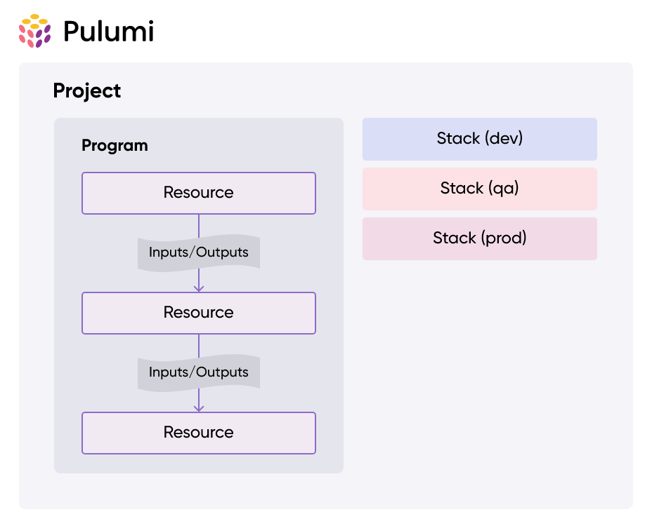

<!-- <style>
  :root {
    --color-foreground: #fff;
    --color-highlight: #f96;
    --color-dimmed: #888;
    --
  }
</style> -->

# Pulumi


Infrastructure as Code (IaC)
https://www.pulumi.com/

---

# Concepts

**1. Use same language for Infrastructure as for Code**

- Javascript/Typescript
- Python
- Go
- C+, VB,F# (.NET)
- Java
- Pulumi YAML

---

# Concepts

**2. Multiple vendors**

- AWS
- Azure
- Google
- Kubernetes

---



# Concepts

**3. Structure**

- Projects
- Stacks
- Resources

---

# Concepts

**4. Inputs and Outputs**

- Inputs describe what the resources do
- Outputs return infos of created resources (like a promise)

---

# Concepts

**5. Configuration**

- Store different Configs for different stages
- Pulumi.<stack-name>.yaml (Pulumi.dev.yaml)
- checking with git

---

# Concepts

**6. Secrets**

- Store secrets encrypted and check them into git
<!-- - TODO -->

---

# HandsOn

- AWS
- Typescript
- Minimal deployment

---

# HandsOn Prerequisites

- Node and npm installed
- docker installed

---

# AWS Setup

- Install AWS CLI
- AWS Account:
  - Security Credentials > Create Access Key > Command Line Interface (CLI)
- `aws configure`
  Note: Please double check that you are logged in to your codecentric account not to any customers account. If you have issues logging in, try deleting the ~/.aws/credentials file and execute `aws configure` again

---

# Pulumi Setup

- install pulumi from this page https://www.pulumi.com/docs/install/
- check installation with `pulumi version`
- Local Setup (you can also use Pulumi Cloud)
- `pulumi login file://~/Downloads/Pulumi_test`

---

# Choose your Language

```bash
mkdir quickstart
cd quickstart
pulumi new aws-typescript
```

---

# Deploy your Setup

- creates an S3-Bucket

```bash
pulumi up
```

Inspect the stack

```bash
pulumi stack
```

```bash
pulumi stack output bucketName
```

---

# Task1

- Deploy the `index.html` as a static website to AWS. Use an S3 Bucket here.
  (Tipp: just go through the Pulumi Get Started Guide if you have no ideas https://bucketa-57c106b.s3.eu-central-1.amazonaws.com/bucketA-index.html)

---

# Task2

- Deploy the same `index.html` to 3 different buckets in a loop using your chosen programming languages abilities

---

# Destroy your stack

```bash
pulumi destroy
```

---

# Don't know how to start?

https://www.pulumi.com/ai

---

# Why not just use Terraform?

- Terraform is not strict OpenSource anymore
- I don't like YAML!

---

# Pulumi Advantages (opinionated)

- Integrated into your setup (linter, formatting, testing etc.)
- Infrastructure code can be tested like any other code

---

# Pulumi Drawbacks (opinionated)

- You have more freedom in writing Code (and more opportunities to write crap)
- Usage of Pulumi Cloud is default
