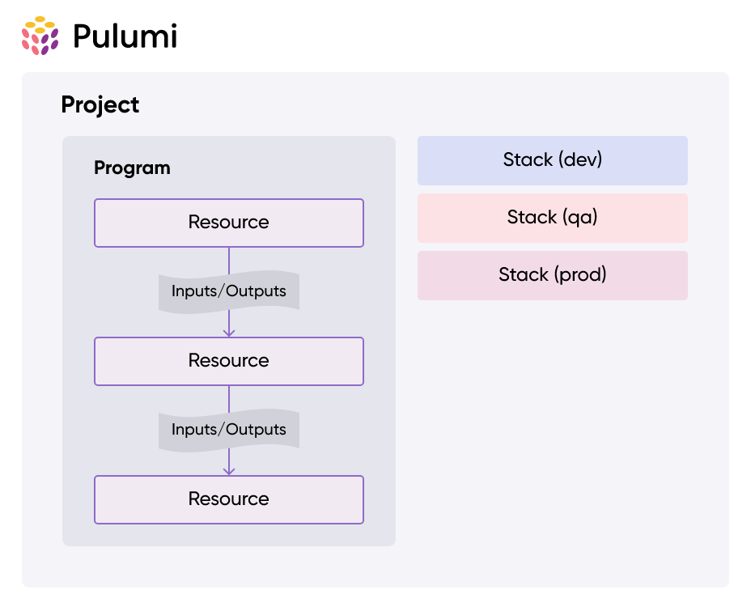

# Pulumi

Infrastructure as Code (IaC)
https://www.pulumi.com/


---

# Concepts

---

## Use same language for Infrastructure as for Code application code

- Javascript/Typescript
- Python
- Go
- C+, VB,F# (.NET)
- Java
- Pulumi YAML

---

## Multiple vendors

- AWS
- Azure
- Google
- Kubernetes
- ... and over 100 more

---



## Structure

- Projects
- Stacks
  - dev, qa, prod ...
- Resources
  - vm, container, database ...

---

## Stacks

Each stack has an own configuration which can be initialized via

```bash
pulumi stack init staging
```

To initialize a stack with the config from another stack use:

```bash
pulumi stack init staging --copy-config-from dev
```

---

## Inputs and Outputs

- Inputs describe the resources and what they shall do
- Outputs return infos of created resources (like a promise)
- The dependency of outputs gives the order of resource creation

---

## Inputs and Outputs example

```typescript
// password is an output
const password = new random.RandomPassword("password", {
  length: 16, // this is an Input
  special: true, // ...and this
  overrideSpecial: "!#$%&*()-_=+[]{}<>:?", // ...and this
});

// the database implicitly depends on the output of password
const database = new aws.rds.Instance("database", {
  instanceClass: "db.t3.micro",
  allocatedStorage: 64,
  engine: "mysql",
  username: "someone",
  password: password.result, // We pass the output from password as an input
});

export const databaseArn = database.arn; // export an output to the config file
```

```bash
pulumi stack output password --show-secrets
```

---

## Configuration

- Store different Configs for different stages
- Pulumi.<stack-name>.yaml (Pulumi.dev.yaml)
- structure similar to `application.properties` in Spring
- checking in with git

---

## Plain Text and Secrets

- Store plain text parameters or encrypted secrets and check them into git
- manage keys with different vendors eg. AWS Key Management Service (KMS)

Setting from CLI:

```bash
pulumi config set name userName # set a plain-text value
pulumi config set --secret dbPassword S3cr37 # set an encrypted secret value
```

Usage in code:

```typescript
import * as pulumi from "@pulumi/pulumi";

const config = new pulumi.Config();
const dbPassword = config.require("userName");
const dbPassword = config.requireSecret("dbPassword");
```

---

## Managed Secrets or passphrase

To set a method for secrets encryption for the current stack:

```bash
pulumi stack change-secrets-provider "<secrets-provider>"
```

Possible values: default, passphrase, awskms, azurekeyvault, gcpkms,hashivault

example:

```bash
pulumi stack change-secrets-provider \
awskms:///arn:aws:kms:us-east-1:111122223333:key/1234abcd-12ab-34bc-56ef-1234567890ab
```

---

# Hands On

---

## Example

- AWS
- Typescript
- Minimal deployment

## Prerequisites

- Node and npm installed
- docker installed
- AWS configured

... but you are free to use any other supported language

---

## AWS Setup

- Install AWS CLI from https://docs.aws.amazon.com/cli/latest/userguide/getting-started-install.html
- AWS Account:
  - Security Credentials > Create Access Key > Command Line Interface (CLI) > Save your credentials
- `aws configure`
  Note: Please double check that you are logged in to your codecentric account not to any customers account. If you have issues logging in, try deleting the ~/.aws/credentials file and execute `aws configure` again

---

## Pulumi Setup

- install pulumi from this page https://www.pulumi.com/docs/install/
- check installation with `pulumi version`
- Local Setup (you can also use Pulumi Cloud)
- `pulumi login file://~/path/to/pulumi/state`
- creates a `.pulumi` folder which should _not_ be checked into git

---

## Choose your Language

```bash
mkdir quickstart
cd quickstart
pulumi new aws-typescript
```

---

## Deploy your Setup

- creates an S3-Bucket

```bash
pulumi up
```

Inspect the stack

```bash
pulumi stack
```

```bash
pulumi stack output bucketName
```

---

## Task1

- Deploy the `index.html` as a static website to AWS. Use an S3 Bucket here.
  (Tipp: just go through the Pulumi _Get Started Guide_ if you have no idea how to start https://bucketa-57c106b.s3.eu-central-1.amazonaws.com/bucketA-index.html)

---

## Task2

- Deploy the same `index.html` to 3 different buckets in a loop using your chosen programming languages abilities

---

## Task3

Copy the content of `tasks/task3.ts` to `pulumiWorkshop/index.ts`

Unit testing:

1. Take a look at the `index.test.ts` file
2. Run `npm run test` from the project root
3. Fix the errors

Testing: Property and Policy Testing:

1. Create a new folder in your project root called `policy`
2. `cd policy`
3. `pulumi policy new aws-typescript`
4. Copy the content of `tasks/task3-policies.ts` into `pulumiWorkshop/policy/index.ts`
5. In the root of your project run `pulumi preview --policy-pack ./policy`
6. Review the issues and improve.

After fixing the tests: run `pulumi up` again and have a look on the outputs. What do you see?

## Destroy your stack

```bash
pulumi destroy
```

---

## Task4

Setting parameters and secrets for a stack.

```
pulumi config set --stack <yourStackName> dbUsername admin
pulumi config set --stack <yourStackName> --secret dbPassword S3cr37
pulumi config --stack <yourStackName>
```

Output:

```
dbUsername       admin
dbPassword   [secret]
```

---

## Don't know how to start?

https://www.pulumi.com/ai

---

## Why not just use Terraform?

- Terraform is not strict OpenSource anymore
- I don't like YAML!

---

## Pulumi Advantages (opinionated)

- Integrated into your setup (linter, formatting, testing etc.)
- Infrastructure code can be tested like any other code

---

## Pulumi Drawbacks (opinionated)

- You have more freedom in writing Code (and more opportunities to write crap)
- Usage of Pulumi Cloud is default, self managing can cause issues with drifting states
- Unit and Policy testing seem very close and exporting the resources automatically makes them outputs
